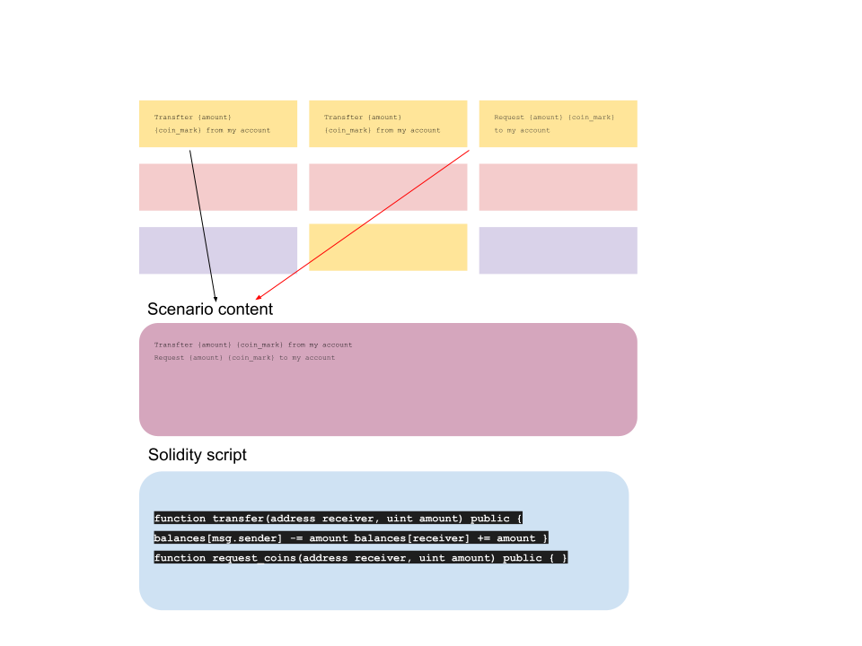

### About project
#### Smart Contracts Scenario builder
- Build your own Smart Contracts even you are do not familiar with things a lot.
Simple words - we allow to build a Smart contracts any person who do not familiar with crypto tools at all and how to use them.

### Prepare project to run
- See ./bin/pre-run.sh

### Project structure
- src (source code)
- builder (datascience model)
- config (the environment configs)

<html>
<body>

The project image logo

Builder workflow

</body>
</html>